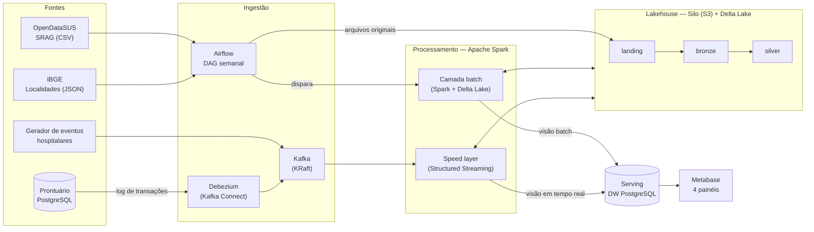
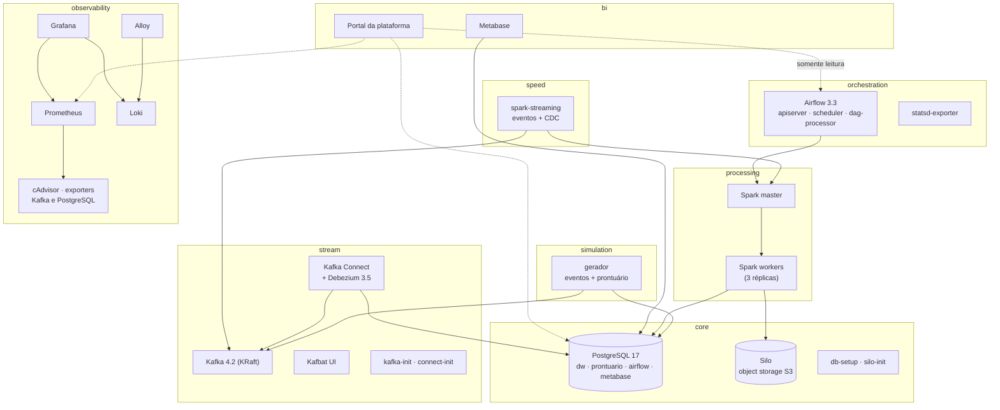
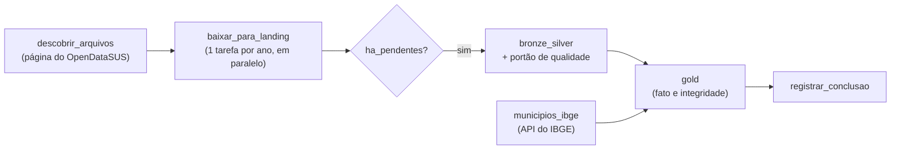
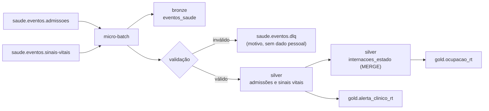
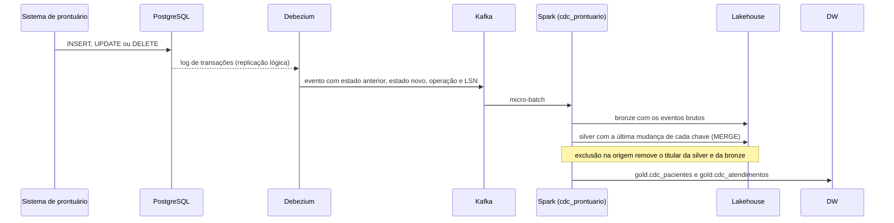
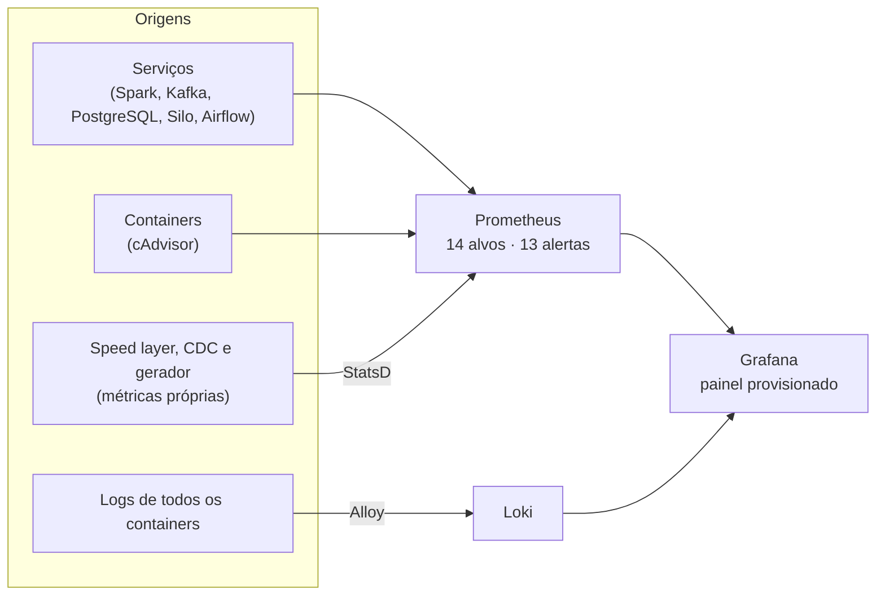

# Plataforma de Dados de Saúde — Case de Engenharia de Dados

Plataforma de dados para o domínio de saúde, construída inteiramente com ferramentas open source e executada em Docker. A solução segue a **arquitetura Lambda** sobre um **lakehouse** (camadas landing, bronze, silver e gold), com ingestão em lote, em streaming e por CDC, observabilidade de ponta a ponta e controles de segurança e privacidade alinhados à **LGPD**.

> **Status:** plataforma completa e verificada de ponta a ponta (`make smoke`): batch layer com dados reais do OpenDataSUS, speed layer, CDC do prontuário, painéis de BI e um portal de acompanhamento para o usuário.
>
> **Por onde começar:** depois de subir a plataforma, abra o **portal** em http://localhost:8090. Ele mostra se tudo está funcionando, em que etapa está a carga, onde houve erro e os links para os painéis e as ferramentas.

**Sumário**

- [I. Objetivo do case](#i-objetivo-do-case)
- [II. Arquitetura de solução e arquitetura técnica](#ii-arquitetura-de-solução-e-arquitetura-técnica)
- [III. Explicação sobre o case desenvolvido](#iii-explicação-sobre-o-case-desenvolvido)
- [IV. Melhorias e considerações finais](#iv-melhorias-e-considerações-finais)
- [Apêndice A — Como executar](#apêndice-a--como-executar)
- [Apêndice B — Solução de problemas](#apêndice-b--solução-de-problemas)
- [Apêndice C — Estrutura do repositório](#apêndice-c--estrutura-do-repositório)

---

## I. Objetivo do case

### O desafio

Projetar e implementar uma solução de engenharia de dados capaz de lidar com grande volume de dados, cobrindo extração, ingestão, armazenamento, observabilidade, segurança, mascaramento, arquitetura de dados e escalabilidade, de forma reproduzível em outra máquina.

### O domínio escolhido: saúde pública e operação hospitalar

O domínio de saúde foi escolhido por reunir, de forma natural, os pontos centrais do desafio:

- **Dados sensíveis:** dados de saúde são dados pessoais sensíveis pela LGPD (art. 5º, II, e art. 11), o que torna segurança, minimização e mascaramento requisitos reais, e não acessórios.
- **Volume real:** o OpenDataSUS publica as notificações de Síndrome Respiratória Aguda Grave (SRAG) em arquivos de centenas de megabytes por ano.
- **Duas velocidades:** a vigilância epidemiológica trabalha com o histórico, consolidado por semana; a operação hospitalar precisa saber o que está acontecendo agora. É exatamente o cenário para o qual a arquitetura Lambda foi concebida.

### Perguntas de negócio atendidas

| Pergunta | Camada | Onde é respondida |
|---|---|---|
| Como evoluem casos, internações em UTI e óbitos por SRAG, por semana epidemiológica, UF, município e faixa etária? | Batch | Painel 1 — Vigilância de SRAG |
| Quantos pacientes estão internados, em UTI e em estado grave agora? Quais alertas clínicos críticos surgiram nos últimos minutos? | Speed | Painel 2 — Operação hospitalar em tempo real |
| Como a situação atual de cada UF se compara ao histórico do ano? | Serving (Lambda) | Painel 3 — Visão integrada |
| Os dados carregados são confiáveis? De onde vieram e quando? | Governança | Painel 4 — Qualidade e ingestão |
| A plataforma está funcionando? A carga terminou? Se falhou, onde e por quê? | Operação | Portal da plataforma |

### Fontes de dados

| Fonte | Natureza | Formato | Volume | Modo de ingestão |
|---|---|---|---|---|
| OpenDataSUS — SRAG (SIVEP-Gripe) | Dados abertos do Ministério da Saúde | CSV, 194 colunas | 921 MB e 816.655 notificações (2024 a 2026) | Lote semanal, incremental |
| IBGE — API de Localidades | API pública | JSON | 5.571 municípios | Lote |
| Gerador de eventos hospitalares | Simulação (Faker `pt_BR`) | JSON no Kafka | 50 eventos/s por padrão (cerca de 4,3 milhões por dia), configurável | Streaming |
| Prontuário eletrônico | Banco transacional simulado (PostgreSQL) | Tabelas relacionais | Cerca de 2 operações/s | CDC contínuo (Debezium) |

As quatro fontes cobrem os formatos citados no desafio: **arquivos CSV**, **API pública**, **streaming de eventos** e **banco de dados**.

### Onde cada requisito é atendido

| Requisito do desafio | Seção |
|---|---|
| 1. Extração de dados | [III.1](#iii1-extração-de-dados) |
| 2. Ingestão (lote, contínua e em tempo real; Lambda e Kappa) | [III.2](#iii2-ingestão-de-dados) |
| 3. Armazenamento (escolha, alternativas, nuvem ou on-premises) | [III.3](#iii3-armazenamento-de-dados) e [II.5](#ii5-decisões-de-tecnologia-e-alternativas) |
| 4. Observabilidade | [III.5](#iii5-observabilidade) |
| 5. Segurança de dados e LGPD | [III.6](#iii6-segurança-de-dados-e-lgpd) |
| 6. Mascaramento de dados | [III.7](#iii7-mascaramento-e-anonimização) |
| 7. Arquitetura de dados | [II](#ii-arquitetura-de-solução-e-arquitetura-técnica) e [III.8](#iii8-modelagem-e-camada-de-serving) |
| 8. Escalabilidade | [III.9](#iii9-escalabilidade) |
| Reprodutibilidade | [Apêndice A](#apêndice-a--como-executar) |

---

## II. Arquitetura de solução e arquitetura técnica

### II.1 Visão geral da solução (arquitetura Lambda)



- **Camada batch:** processa o conjunto mestre completo e recalcula as visões a cada carga. É lenta, mas completa e corrigível: um erro descoberto depois (como o dos municípios do Distrito Federal, na seção IV) é corrigido reprocessando a partir dos dados brutos.
- **Speed layer:** processa os eventos continuamente, em micro-batches, e mantém visões incrementais de baixa latência: alertas clínicos, ocupação e o espelho do prontuário.
- **Camada de serving:** o DW no PostgreSQL reúne as duas visões, e o painel "Visão integrada" as combina lado a lado.
- **Transversais:** observabilidade (métricas, logs e alertas de todos os componentes) e segurança (criptografia em trânsito e em repouso, menor privilégio, mascaramento e minimização) atravessam todas as camadas, como detalhado nas seções III.5 a III.7.

### II.2 Camadas de dados

| Camada | Onde fica | Conteúdo | Formato | Quem grava | Quem lê |
|---|---|---|---|---|---|
| Landing | Bucket `landing` | Arquivos originais do OpenDataSUS, versionados pela data de recorte | CSV | Airflow (`svc-ingestao`) | Spark (`svc-pipeline`) |
| Bronze | Bucket `bronze` | Dado bruto, fiel à origem, com metadados de ingestão (arquivo, tópico, partição, offset, horário) | Delta Lake | Spark | Spark |
| Silver | Bucket `silver` | Dado tipado, validado, deduplicado e pseudonimizado; espelho do prontuário; estado atual das internações | Delta Lake | Spark | Spark |
| Gold (serving) | DW PostgreSQL, schema `gold` | Fato e dimensões, tabelas de tempo real e visões para o BI, sem dados pessoais | Tabelas relacionais | Spark e Airflow (`dw_owner`, via TLS) | Metabase (`bi_reader`) |
| Governança | DW PostgreSQL, schemas `qualidade` e `auditoria` | Resultado das regras de qualidade e controle das cargas | Tabelas relacionais | Spark e Airflow | Metabase (`bi_reader`) |

O bucket `gold` do lakehouse fica reservado para produtos de dados em arquivo, com acesso somente de leitura para o perfil de analista. Nesta versão, a camada gold é servida pelo DW, que atende o BI com baixa latência e controle de acesso por papel.

### II.3 Arquitetura técnica



Cada caixa externa é um **profile** do Docker Compose, o que permite subir apenas parte da plataforma em máquinas com menos memória (Apêndice A). Todos os serviços rodam numa rede Docker isolada; apenas as interfaces e as portas de conexão necessárias são publicadas no host.

| Componente | Versão | Papel |
|---|---|---|
| PostgreSQL | 17 | DW (serving), prontuário (fonte OLTP do CDC) e metadados do Airflow e do Metabase |
| Silo | fork comunitário do MinIO | Object storage com API S3 e criptografia em repouso (KMS) |
| Apache Kafka | 4.2.1 (KRaft, sem ZooKeeper) | Barramento de eventos e transporte do CDC |
| Kafka Connect + Debezium | 3.5.2 | Captura de mudanças no PostgreSQL por replicação lógica |
| Kafbat UI | 1.3.0 | Inspeção de tópicos e mensagens, com mascaramento de campos |
| Apache Spark | 4.1.3 | Processamento em lote e em streaming (imagem própria com os conectores) |
| Delta Lake | 4.4.0 | Formato transacional do lakehouse (ACID, `MERGE`, histórico de versões) |
| Apache Airflow | 3.3.2 | Orquestração da camada batch |
| Metabase | 0.58 | BI e painéis, criados como código pela API |
| Portal da plataforma | FastAPI 0.141 | Página de acompanhamento para o usuário, somente leitura |
| Prometheus, Grafana, Loki e Alloy | 3.14, 13.2, 3.7 e 1.19 | Métricas, painéis, logs e coleta de logs |

### II.4 Fluxos de dados

**Camada batch** (DAG `batch_srag`, semanal):



**Speed layer** (micro-batches de 30 segundos):



**CDC do prontuário** (micro-batches de 60 segundos):



### II.5 Decisões de tecnologia e alternativas

| Decisão | Escolha | Alternativas consideradas | Justificativa |
|---|---|---|---|
| Arquitetura | Lambda | Kappa | As fontes históricas chegam como arquivos semanais, e a recomputação completa a partir dos dados brutos é o que permite corrigir erros descobertos depois. A operação hospitalar, por outro lado, exige tempo real. Uma arquitetura Kappa exigiria reproduzir os arquivos como streams, com mais complexidade e sem ganho para este caso |
| Formato do lakehouse | Delta Lake | Apache Iceberg, Apache Hudi, Parquet puro | Transações ACID, `MERGE` para o estado e o espelho do CDC, histórico de versões e integração nativa com o Spark. O Iceberg seria a escolha para vários motores e escritores concorrentes, com catálogo transacional (seção IV) |
| Object storage | Silo (API S3) | MinIO, AWS S3, Azure Data Lake, Google Cloud Storage | Gratuito, local e reproduzível, com a mesma API do S3: os caminhos `s3a://` funcionam sem mudança num provedor de nuvem |
| Serving e DW | PostgreSQL | ClickHouse, DuckDB, Redshift, BigQuery, Snowflake | O volume da gold (cerca de 531 mil linhas agregadas) cabe com folga num PostgreSQL, que oferece TLS, papéis, permissões por schema e conexão direta com o BI. Com volumes na casa dos terabytes, um motor colunar ou um DW gerenciado passaria a ser mais adequado |
| Barramento de eventos | Apache Kafka (KRaft) | Amazon Kinesis, Google Pub/Sub, Apache Pulsar, RabbitMQ | Particionamento para paralelismo, retenção e releitura (replay), e o ecossistema do Kafka Connect, que viabiliza o CDC com Debezium. O modo KRaft dispensa o ZooKeeper |
| Processamento | Apache Spark | Apache Flink, pandas ou DuckDB | Um único motor para as duas camadas, compartilhando código (como a biblioteca de mascaramento), com integração nativa ao Delta Lake e escala horizontal. O Flink reduziria a latência para milissegundos, ao custo de manter um segundo motor |
| Captura de mudanças | Debezium (baseado em log) | Consultas periódicas por data de atualização | Captura também as exclusões, preserva a ordem pelo LSN e não gera carga de consultas nas tabelas de origem |
| Orquestração | Apache Airflow | Dagster, Prefect | Padrão de mercado, com operador nativo para o Spark, tarefas dinâmicas (um download por ano) e métricas via StatsD |
| BI | Metabase | Apache Superset | Mais simples de operar e com API completa, usada para criar os painéis como código. O Superset oferece mais recursos, com operação mais pesada |
| Observabilidade | Prometheus, Grafana, Loki e Alloy | Elastic Stack, OpenSearch | Mais leve para rodar localmente e reúne métricas e logs no mesmo Grafana |

---

## III. Explicação sobre o case desenvolvido

### III.1 Extração de dados

| Fonte | Como é extraída | Destaques |
|---|---|---|
| OpenDataSUS (CSV) | A DAG lê a página do conjunto de dados e extrai os links diretos dos arquivos, escolhendo o recorte mais recente de cada ano | O nome do arquivo muda a cada atualização semanal (por exemplo, `INFLUD25-14-09-2026.csv`), por isso não há caminho fixo no código |
| IBGE (API JSON) | Requisição à API de Localidades, com tratamento dos municípios criados recentemente, que ainda não têm microrregião no cadastro | Os 5.571 municípios são gravados por *upsert*, sem duplicar |
| Gerador de eventos | Aplicação Python que publica eventos de admissão, transferência, alta e sinais vitais de 12 capitais, com evolução clínica coerente com a gravidade e o diagnóstico | Cerca de 1% dos eventos é corrompido de propósito, para exercitar a validação e a fila de mensagens inválidas |
| Prontuário (PostgreSQL) | O Debezium lê o log de transações por replicação lógica, com uma publicação restrita às duas tabelas do prontuário | Captura inserções, atualizações e exclusões sem consultar as tabelas |

### III.2 Ingestão de dados

A plataforma combina os três modos de ingestão pedidos, na arquitetura Lambda:

- **Em lote (ETL incremental):** a DAG `batch_srag` roda semanalmente e registra a versão de cada arquivo (`Last-Modified`) em `auditoria.controle_ingestao`. Um arquivo só é baixado e processado quando muda. O download é feito em streaming, direto para a landing, sem gravar em disco, com o usuário `svc-ingestao`, que só tem permissão de gravar nessa camada.
- **Contínua e em tempo real (streaming):** a speed layer consome os tópicos do Kafka em micro-batches de 30 segundos.
- **Por captura de mudanças (CDC):** o Debezium publica cada alteração do prontuário no Kafka, e uma segunda query de streaming aplica as mudanças no lakehouse a cada 60 segundos.

**Garantias de entrega.** As gravações no Delta Lake são idempotentes por micro-batch (identificador da aplicação e número do lote). Se um lote é reprocessado depois de uma falha, o Delta reconhece a transação e não grava duplicatas. Os offsets consumidos ficam no checkpoint de cada query, e o produtor do gerador usa idempotência no Kafka. Na prática, as tabelas do lakehouse recebem cada evento **exatamente uma vez**. No DW e na fila de inválidos, a garantia é **pelo menos uma vez**: um reprocessamento pode repetir a inserção de um alerta, e a visão `vw_alertas_clinicos` elimina as duplicatas; as tabelas de ocupação e do CDC são sobrescritas a cada lote, e por isso não duplicam.

**Proteção contra sobrecarga.** Cada query tem um teto de eventos por lote (5 mil para os eventos e 3 mil para o CDC). Depois de uma parada, o acumulado é recuperado em vários lotes de tamanho normal, em vez de um lote gigante que atrasaria todos os seguintes.

### III.3 Armazenamento de dados

**Lakehouse no object storage.** Os dados brutos e tratados ficam em Delta Lake sobre o Silo, que oferece a API do S3. A escolha considera os três "V":

| Dimensão | Necessidade | Como o Delta Lake sobre object storage atende |
|---|---|---|
| Volume | Centenas de megabytes por ano no SRAG e milhões de eventos por dia no streaming | Armazenamento barato e elástico, com arquivos Parquet comprimidos e particionamento por ano e por data de ingestão |
| Velocidade | Gravações a cada 30 segundos, em paralelo às cargas em lote | Transações ACID: leitores nunca veem um lote pela metade |
| Variedade | CSV com 194 colunas, JSON de eventos e envelopes do Debezium | A bronze guarda o dado como chegou; o esquema é aplicado na silver, com evolução de esquema controlada |

**DW para o serving.** A gold vai para o PostgreSQL, que atende o BI com baixa latência, permissões por schema e TLS obrigatório. O lakehouse é a fonte da verdade: o DW pode ser reconstruído a qualquer momento a partir da silver.

**Nuvem ou on-premises.** A plataforma roda on-premises (localmente, em Docker) para ser gratuita e reproduzível, mas foi desenhada para migrar sem reescrita, porque cada componente tem um equivalente gerenciado:

| Componente local | AWS | Azure | Google Cloud |
|---|---|---|---|
| Silo + Delta Lake | S3 + Delta Lake (ou Databricks) | ADLS Gen2 + Databricks | Cloud Storage + Dataproc |
| Kafka + Debezium | Amazon MSK + MSK Connect | Event Hubs (API Kafka) | Managed Service for Apache Kafka |
| Spark | EMR ou Databricks | Databricks ou Synapse | Dataproc |
| Airflow | MWAA | Data Factory (Managed Airflow) | Cloud Composer |
| PostgreSQL | RDS ou Aurora | Azure Database for PostgreSQL | Cloud SQL |
| Prometheus e Grafana | Managed Prometheus e Managed Grafana | Azure Monitor e Managed Grafana | Managed Service for Prometheus |

Na nuvem, ganham-se escalabilidade elástica, alta disponibilidade gerenciada, chaves no serviço de KMS do provedor e identidades federadas (IAM) no lugar dos usuários de serviço. On-premises, ganham-se controle total e custo previsível, com a responsabilidade de operar backup, alta disponibilidade e atualizações. Para dados de saúde, a nuvem exige avaliar a localização dos dados e a transferência internacional (LGPD, art. 33).

### III.4 Qualidade de dados

A camada batch tem um **portão de qualidade**: as regras são avaliadas antes de publicar a silver de cada ano, e o resultado de cada uma é gravado em `qualidade.verificacao`, visível no Painel 4.

| Tipo de regra | Exemplos | Efeito da falha |
|---|---|---|
| Crítica | Arquivo com registros; notificações sem número; datas de primeiros sintomas ausentes | A silver daquele ano **não é publicada**, e o arquivo fica pendente para a próxima execução |
| Alerta | Duplicidades; UF de residência ausente; idade inválida; sintomas fora do ano da base; casos sem município no cadastro do IBGE | O dado é publicado, e o alerta fica registrado para investigação |

**Resultado na carga de 2024 a 2026:** as 26 regras foram aprovadas, sem nenhuma duplicidade nem notificação sem número. A regra de integridade referencial da gold detectou um problema real, descrito na seção IV: cerca de 3% dos casos com municípios inexistentes no IBGE. Depois da correção e do reprocessamento, o índice caiu para 0,034%, que corresponde aos casos sem município informado.

A speed layer também valida cada evento (campos obrigatórios, tipos e faixas fisiológicas plausíveis). Os inválidos vão para a fila `saude.eventos.dlq`, com o motivo e a referência ao registro na bronze, sem dados pessoais.

### III.5 Observabilidade



A estratégia cobre as três perguntas do requisito:

- **Rastrear o fluxo de dados.** Cada registro da bronze carrega a origem (arquivo, ou tópico, partição e offset), e cada evento inválido na DLQ aponta para o registro correspondente. O controle de ingestão registra a versão de cada arquivo carregado. As métricas acompanham o fluxo em cada etapa: eventos gerados por segundo, mensagens por tópico, entrada e processamento de cada query de streaming, e operações no prontuário contra mudanças aplicadas pelo CDC.
- **Detectar falhas.** São 13 regras de alerta no Prometheus: serviço indisponível, Spark sem workers, Kafka sem broker, *consumer lag* alto, memória alta em container, disco quase cheio, conexões em excesso no PostgreSQL, tarefa do Airflow com falha, eventos que deixam de chegar aos tópicos, speed layer atrasada ou sem progresso, CDC sem progresso e taxa alta de eventos inválidos. Os alertas apontam a causa, e não o sintoma em cascata: se os eventos param de chegar, dispara "Nenhum evento chegando aos tópicos", e não "Speed layer parada", porque a speed layer só é cobrada quando há eventos para processar. Os logs de todos os containers vão para o Loki, com um painel de erros por serviço.
- **Identificar gargalos.** O painel "Plataforma de Dados — Visão Geral" tem sete seções: saúde dos serviços, recursos dos containers, streaming, speed layer, orquestração e processamento, armazenamento e CDC. Foi por ele, por exemplo, que o dimensionamento do intervalo da speed layer foi decidido (seção III.9).

A plataforma também se verifica sozinha: o `make smoke` checa todos os containers e conexões e executa três fluxos reais de ponta a ponta (Airflow e Spark gravando no lakehouse e no DW, um evento chegando como alerta no DW e uma alteração no prontuário chegando pelo CDC), além dos 18 controles de segurança.

### III.6 Segurança de dados e LGPD

| Camada | Controle | Como foi implementado |
|---|---|---|
| Em trânsito | TLS obrigatório no PostgreSQL | Conexões sem TLS são recusadas no `pg_hba.conf`; senhas com SCRAM-SHA-256. O Spark, o Airflow, o Metabase, o Debezium e o gerador conectam-se com TLS |
| Em repouso | Criptografia no object storage | Todos os buckets com criptografia automática (SSE-S3), com chave gerenciada pelo KMS do Silo |
| Acesso ao lakehouse | Menor privilégio por camada | `svc-ingestao` só grava na landing; `svc-pipeline` processa bronze, silver e gold; `svc-analista` só lê a gold |
| Acesso ao DW | Papéis por finalidade | `bi_reader` lê apenas a gold e os resultados de qualidade; `monitoring` só acessa estatísticas; dados identificáveis ficam isolados no schema `restrito` |
| Segredos | Nada versionado | Senhas e chaves aleatórias geradas por `make setup` no `.env` (fora do Git); a senha do banco do CDC é resolvida pelo Kafka Connect em tempo de execução e não fica gravada na configuração do conector; credenciais do Metabase criptografadas e sessões assinadas |
| Auditoria | Registro das operações | Alterações em dados identificáveis são gravadas em `auditoria.log_alteracoes`, e cada carga fica registrada em `auditoria.controle_ingestao` |

**Aderência à LGPD:**

| Dispositivo | Exigência | Implementação |
|---|---|---|
| Art. 6º, III (necessidade) | Tratar apenas o mínimo necessário | A silver descarta nome, contato, data de nascimento e ocupação, mesmo nos dados abertos do SRAG; ficam só os atributos usados na análise |
| Art. 11 (dados sensíveis) | Proteção reforçada a dados de saúde | Nenhum dado pessoal chega à gold nem ao BI; o acesso ao dado identificável é restrito a papéis específicos |
| Art. 13, § 4º (pseudonimização) | Informação adicional mantida separadamente e em ambiente seguro | O CPF vira um HMAC-SHA256 cuja chave fica só no ambiente de execução do pipeline; sem ela, o pseudônimo não pode ser recalculado nem atacado por força bruta |
| Art. 18, VI (eliminação) | Eliminar os dados do titular a pedido | A função `seguranca.eliminar_titular()` no DW e, no CDC, a propagação da exclusão da origem até a silver e a bronze do lakehouse |
| Art. 37 (registro das operações) | Manter registro do tratamento | Trilhas de auditoria e controle de ingestão |
| Art. 46 (segurança) | Medidas técnicas contra acessos não autorizados | Criptografia em trânsito e em repouso, menor privilégio e os 18 controles verificados automaticamente por `make security-check` |

### III.7 Mascaramento e anonimização

As técnicas estão na biblioteca `jobs/common/mascaramento.py`, compartilhada pelas camadas batch e streaming, e têm propósitos diferentes:

| Técnica | Exemplo | Reversível? | Onde é aplicada |
|---|---|---|---|
| Pseudonimização (HMAC-SHA256 com chave secreta) | CPF → identificador de 64 caracteres, sempre o mesmo para o mesmo CPF | Não, sem a chave | Silver: permite cruzar o prontuário e os eventos de internação sem expor o CPF |
| Mascaramento parcial | `123.456.789-01` → `***.456.789-**`; `Maria Souza` → `M**** S****`; telefone → `(11) *****-4321` | Não | Views do BI e interface do Kafka |
| Generalização | Data de nascimento → faixa etária de 10 anos (`80+` agrupado); CEP → `01310-***` | Não | Silver e gold |
| Supressão (minimização) | Nome, contato, ocupação e data de nascimento removidos | Não | Silver |
| Verificação de k-anonimato | Aponta combinações de quase-identificadores com menos de k registros | — | Antes de publicar dados agregados |

Os controles aparecem em três pontos da plataforma:

- **No BI:** o usuário `bi_reader` só enxerga a view mascarada, e o `make security-check` confirma que o CPF exibido é `***.456.789-**`.
- **Na inspeção do Kafka:** a Kafbat UI mascara CPF, nome, telefone, e-mail, endereço e data de nascimento em todos os tópicos de eventos e de CDC, inclusive dentro do envelope do Debezium. Os campos técnicos (chaves, UF, datas de controle) continuam visíveis para diagnóstico.
- **Na demonstração:** `make mascaramento-demo` aplica todas as técnicas com o Spark sobre dados de exemplo.

### III.8 Modelagem e camada de serving

| Objeto | Tipo | Conteúdo |
|---|---|---|
| `gold.fato_srag_semanal` | Fato | Casos, hospitalizações, UTI, ventilação invasiva, óbitos e vacinados, por semana epidemiológica, município, faixa etária, sexo, classificação final e evolução |
| `gold.dim_municipio` | Dimensão | Municípios do IBGE, com UF, região e código de 6 dígitos usado pelo DATASUS |
| `gold.dim_data` | Dimensão | Calendário de 2015 a 2035, com semana epidemiológica |
| `gold.alerta_clinico_rt` e `gold.ocupacao_rt` | Tempo real | Alertas por sinais vitais críticos e ocupação por hospital e setor |
| `gold.cdc_pacientes` e `gold.cdc_atendimentos` | Tempo real (CDC) | Situação do espelho do prontuário e titulares eliminados |
| `gold.vw_*` | Visões | Letalidade por UF e semana, casos por município, alertas com latência, ocupação por UF e paciente com dados mascarados |

A fato é agregada: a notificação individual fica na silver, pseudonimizada, e o BI trabalha com contagens, o que reduz o volume e o risco de reidentificação.

**Painéis como código.** Os quatro painéis do Metabase são criados pela API (`make metabase`), com as consultas versionadas em `scripts/metabase_paineis.py`. A camada de visualização é reproduzível como o resto da plataforma.

### III.9 Escalabilidade

**Horizontal.** O cluster Spark escala adicionando workers (`SPARK_WORKER_REPLICAS` no `.env`, ou `make scale-workers n=N`), e as queries de streaming usam os núcleos disponíveis até o limite de paralelismo dos tópicos: 9 partições nos tópicos de eventos, o que permite até 9 tarefas simultâneas. Para ir além, aumenta-se o número de partições dos tópicos. No Kafka, novos brokers permitem distribuir as partições; na nuvem, o mesmo desenho se traduz em autoscaling do cluster Spark.

**Vertical.** Memória e núcleos por executor, limites de memória por container e o total disponível para o WSL são parâmetros do `.env` e do `.wslconfig`.

**Medições.** Os números abaixo foram obtidos no próprio ambiente (Windows com WSL2, 32 GB de RAM e disco de dados em HD mecânico):

| Cenário | Configuração | Resultado |
|---|---|---|
| Speed layer com lotes de 10 s | 2 núcleos | Cerca de 17 s de processamento por lote: o atraso crescia continuamente |
| Speed layer com lotes de 30 s | 2 núcleos | Cerca de 13 s por lote e latência média de 28 s do evento ao alerta no DW, estável |
| Speed layer e CDC na mesma aplicação | 2 núcleos | Latência de 69,7 s no teste de ponta a ponta |
| Depois da escala horizontal | 3 workers (6 núcleos), 3 para o streaming e teto de 5 mil eventos por lote | Latência de 51 s no teste de ponta a ponta, com o atraso em zero |
| Speed layer depois de cerca de dois dias sem compactação | 3 núcleos, teto de 5 mil eventos por lote | Cerca de 55 s por lote, com o atraso em zero: acompanha o fluxo, com latência maior (seção IV) |
| CDC | Lotes de 60 s | Cerca de 5 a 8 s da alteração no prontuário ao DW, quando a mudança chega perto do disparo do lote |
| Carga completa do SRAG | 2 núcleos | Cerca de 30 min para 921 MB e 816.655 notificações (15 min em bronze e silver, 7 min na gold) |

O dimensionamento do intervalo da speed layer mostra o raciocínio: o custo de cada lote é quase todo fixo (os commits transacionais no Delta Lake), então lotes maiores diluem esse custo. Com lotes de 10 segundos, o processamento não acompanhava a chegada dos dados; com 30 segundos, sobrou folga.

### III.10 Testes e verificação

| Verificação | Comando | O que cobre |
|---|---|---|
| Testes automatizados | `make test` | 28 testes: 11 da speed layer (validação, pseudonimização, alertas, estado e DLQ), 8 da camada batch (tipagem, minimização, deduplicação, qualidade e municípios do DF), 5 do CDC (envelope do Debezium, última mudança por chave e exclusão) e 4 do portal (consolidação das etapas, trecho do registro de erro e situação geral) |
| Verificação de ponta a ponta | `make smoke` | Todos os containers e conexões, e três fluxos reais: Airflow → Spark → lakehouse e DW; evento → alerta no DW; alteração no prontuário → DW |
| Segurança | `make security-check` | 18 controles: TLS, criptografia em repouso, permissões por papel e por camada, e mascaramento |

**Teste de reprodutibilidade.** Antes da entrega, a instalação foi validada do zero, como faria um avaliador: um clone do repositório numa pasta nova, com volumes e segredos novos, seguindo apenas os comandos do Apêndice A. Tudo rodou sem intervenção, em 44 minutos:

| Etapa | Resultado |
|---|---|
| `make setup` e `make up` | Aprovados, em cerca de 5 minutos (com as imagens em cache) |
| `make test` | 28 testes aprovados |
| `make metabase` | Administrador, conexão e 4 painéis criados do zero pela API |
| Carga do SRAG | Aprovada em 17 minutos, com a descoberta automática dos recortes publicados naquela semana |
| `make smoke` | Aprovado: alerta no DW em 28,7 s, alteração no prontuário no DW em cerca de 1 s, e os 18 controles de segurança |

O mesmo teste mediu o efeito do tempo de operação no mesmo disco mecânico: com tabelas novas, os lotes da speed layer levaram 16,7 s e a pressão de disco ficou em 16%. Na plataforma com dias de operação contínua, os lotes chegavam a 55 a 98 s, com pressão de disco de 46% (seção IV).

### III.11 Portal da plataforma

As ferramentas técnicas (Airflow, Grafana, Kafka UI, Spark) respondem a tudo, mas exigem saber onde procurar. O portal é uma camada fina por cima delas, pensada para o **usuário de negócio**, que responde de relance a quatro perguntas:

| Pergunta | O que o portal mostra | De onde vem |
|---|---|---|
| A plataforma está funcionando? | Uma situação geral (tudo funcionando, pontos de atenção ou falhas) e a lista de problemas em linguagem simples | Alertas e alvos do Prometheus |
| A carga do SRAG deu certo? Em que etapa está? | A última execução como uma linha de etapas, com a etapa atual destacada, os arquivos por ano e o resultado das regras de qualidade | API do Airflow e DW |
| Se falhou, onde e por quê? | A etapa que falhou, o trecho do registro que explica o motivo e o link direto para o registro completo | API do Airflow |
| Onde vejo os resultados? | Links para os quatro painéis do Metabase e, para quem quiser o detalhe, para as ferramentas técnicas | Arquivo gerado por `make metabase` |

A página se atualiza sozinha a cada 15 segundos e mostra também a situação do tempo real: se a speed layer e o CDC estão em dia e quando foi a última atualização de cada um. Quando a speed layer para, o portal distingue a causa: o processamento parado ou os eventos que deixaram de chegar da origem.

Decisões de desenho:

- **Somente leitura e menor privilégio.** O portal consulta o Airflow com um usuário próprio de papel Viewer (criado pelo `airflow-init`) e o DW com o `bi_reader`, via TLS. Ele não consegue disparar, pausar nem alterar nada, e as credenciais ficam no servidor, nunca no navegador.
- **Degradação elegante.** Cada fonte é consultada em paralelo e de forma independente. Se o Airflow sair do ar, o portal avisa que não conseguiu consultá-lo e continua exibindo o resto.
- **Sem duplicar as ferramentas.** O portal mostra o essencial e aponta para onde está o detalhe. Não há gráficos: eles continuam no Metabase e no Grafana.

---

## IV. Melhorias e considerações finais

### Limitações conhecidas

- **Kafka sem autenticação nem criptografia internas.** Os brokers aceitam conexões sem TLS nem SASL dentro da rede Docker. Os eventos e os envelopes do CDC carregam dados pessoais pelo período de retenção dos tópicos (7 dias no CDC). O acesso pela interface exige login e mascara os campos pessoais, mas, em produção, o Kafka precisaria de TLS, SASL e ACLs por tópico, ou da pseudonimização já no conector (transformações do Kafka Connect).
- **Gravações concorrentes no Delta Lake sobre S3.** O object storage não oferece a operação atômica "gravar somente se não existir" de que o log de transações do Delta precisa. Por isso, cada tabela tem um único gravador, as DAGs usam `max_active_runs=1` e o smoke test grava numa tabela exclusiva por execução. Em produção, a solução é um LogStore com coordenação externa (como o baseado em DynamoDB, na AWS) ou um formato com catálogo transacional, como o Iceberg.
- **Remoção física dos dados eliminados.** A eliminação de um titular apaga os registros da silver e da bronze, mas os arquivos antigos só somem do object storage no `VACUUM` do Delta Lake, depois do período de retenção. Uma rotina agendada de `VACUUM` ainda não foi implementada.
- **Arquivos pequenos no streaming (medido).** Cada micro-batch grava arquivos novos nas tabelas Delta, e ainda não há compactação periódica. Depois de cerca de dois dias de operação contínua, a bronze de eventos acumulou 8.215 arquivos com média de 58 KB, a silver de sinais vitais 5.490 arquivos de 39 KB, e a bronze do CDC 6.038 arquivos de 14 KB. O tamanho saudável fica na casa de dezenas a centenas de MB por arquivo. O efeito aparece na duração dos lotes: na speed layer, subiu de cerca de 13 para 55 segundos, ainda sem atraso, mas com latência maior. No CDC, a remoção dos eventos de um titular eliminado percorre todos os arquivos da bronze a cada lote com eliminações. As tabelas atualizadas por `MERGE` (estado das internações e silver do CDC) não sofrem com isso, porque o `MERGE` reescreve os arquivos. Até a compactação automática, a mitigação é manual: `make lakehouse-compactar` para a speed layer, compacta as tabelas fragmentadas e a religa. A correção definitiva está nas melhorias de curto prazo.
- **Interfaces administrativas sem autenticação.** O Prometheus, as interfaces do Spark e o portal não exigem login. O portal não exibe dados pessoais, só situações e totais. Localmente, isso é aceitável; em produção, ficariam atrás de um proxy com autenticação única.
- **Segunda cópia simultânea da plataforma.** A instalação padrão usa sempre o projeto `case-saude`. Para rodar uma segunda cópia ao mesmo tempo (como num teste), é preciso definir outro `COMPOSE_PROJECT_NAME` no ambiente e usar outras portas. Nessa segunda cópia, os logs não chegam ao Loki, porque a coleta do Alloy filtra os containers pelo nome do projeto `case-saude`.
- **Anos anteriores do SRAG.** A carga cobre 2024 a 2026. Os anos de 2019 a 2023 podem ser incluídos pela variável `SRAG_ANOS`, sem mudança de código.

### Lições aprendidas

Construir a plataforma num ambiente real, com recursos limitados, gerou problemas que não aparecem em testes isolados. Cada um virou uma correção, um controle ou uma linha no Apêndice B:

| Incidente | Causa | O que mudou |
|---|---|---|
| Streaming cada vez mais lento, com a CPU quase ociosa | Disco de dados do Docker num HD mecânico: pressão de disco de 40% a 46%, com todos os processos ativos parados esperando o disco em 40% do tempo. A compactação reduziu 23 mil arquivos para 20, mas não resolveu, porque o limite era o disco, e não a quantidade de arquivos | SSD passou a ser requisito, com a justificativa medida (Apêndice A). A lição: medir a causa (pressão de disco) antes de atacar o sintoma (lentidão) |
| O primeiro teste de reprodutibilidade usou os volumes da plataforma original | O `.env.example` fixa `COMPOSE_PROJECT_NAME=case-saude`, e o clone de teste herdou o mesmo nome de projeto. As senhas novas foram recusadas pelos bancos existentes, e nenhum dado foi alterado | O teste passou a usar um projeto próprio, com uma trava que aborta se encontrar containers fora dele. O `smoke.sh` e o `security-check.sh` passaram a respeitar o nome do projeto definido no ambiente, em vez de sobrescrevê-lo com o do `.env` |
| Plataforma inteira fora do ar, com o disco do Docker em somente leitura | SSD do Windows cheio: o disco virtual do Docker não conseguia crescer | Disco de dados movido para outra unidade e alerta `DiscoQuaseCheio`. O alerta cobre o disco virtual por dentro; o disco do Windows precisa de monitoração pelo lado do host |
| Master do Spark sem responder por quase dois minutos | Memória de serviços ociosos enviada ao swap, que estava num HD | Swap de volta ao SSD e `vm.swappiness` reduzido para 10 |
| Pastas de configuração montadas vazias depois de religar a máquina | Containers religados pelo Docker antes de o WSL estar disponível | Política `restart: on-failure`: a plataforma só sobe por `make up`, com o ambiente pronto |
| Containers órfãos e cache de build corrompido | Desligamentos da máquina no meio de gravações | Rotina de `make down` antes de desligar, e procedimentos de recuperação documentados |
| Cerca de 3% dos casos de SRAG sem município no cadastro do IBGE | O SIVEP-Gripe registra as Regiões Administrativas do DF com códigos próprios, enquanto o IBGE tem um único município, Brasília | Códigos padronizados na silver, preservando o original, com teste automatizado e reprocessamento idempotente. **A regra de qualidade detectou o problema**, e não um usuário |
| Carga dos municípios recusada pela API do IBGE (HTTP 400) | Cabeçalho `User-Agent` com acento | Cabeçalhos HTTP restritos a ASCII, com comentário no código |
| Busca da contagem de eliminações cada vez mais lenta | A consulta relia a bronze inteira a cada lote | Contagem incremental: o total anterior mais as eliminações do lote |
| Speed layer sem processar, com o gerador aparentemente no ar | Depois de o Kafka ser recriado, o produtor idempotente do gerador entrou num estado do qual não saía sozinho, e todas as mensagens expiravam sem ser entregues. O alerta disparado ("Speed layer parada") apontava o sintoma, e não a causa | O gerador passou a encerrar com erro quando o produtor não consegue entregar (*fail fast*), e o Docker o reinicia com um produtor novo. Novo alerta "Nenhum evento chegando aos tópicos", medido no próprio Kafka, e o alerta da speed layer passou a exigir que haja eventos chegando. O portal diferencia as duas situações |
| Speed layer em ciclo de reinícios | Defeito no conector Kafka do Spark 4.1.2 (relato #55236 no repositório do Spark): ao retomar um lote interrompido no meio, a query falhava ao calcular as métricas da fonte. Repetia-se a cada parada no meio de um lote | Contorno imediato com a geração de checkpoints versionada (`make streaming-recomecar`) e, depois, a **correção na origem**: atualização para o Spark 4.1.3, depois de confirmar no código-fonte da versão que a correção estava incluída. Durante a investigação, o escalonamento FAIR entre as queries foi testado e revertido |
| Portal mostrando a speed layer parada há 14 horas | O mesmo defeito, disparado pela recriação do container durante a instalação do portal | **O portal detectou o problema no primeiro uso**, antes de qualquer usuário perceber pelos painéis |

A lição geral: **observabilidade e verificação automatizada pagaram o próprio custo**. Os diagnósticos foram feitos com as métricas do Prometheus, os logs centralizados e o `make smoke`. Cada correção foi validada pelos mesmos instrumentos, antes de ser considerada concluída.

### Melhorias propostas

**Curto prazo:**

1. Compactação periódica (`OPTIMIZE`) e limpeza (`VACUUM`) das tabelas do streaming, feitas pela própria aplicação de streaming a cada certo número de lotes. Como ela é a única gravadora dessas tabelas, a manutenção não disputa gravações com outro processo, o que evita conflitos no Delta Lake sobre S3. Na bronze do CDC, a compactação ordenada pelo identificador do titular (`ZORDER`) permite que a remoção de um titular leia só os arquivos que o contêm. O `VACUUM` completa a eliminação, apagando fisicamente os arquivos antigos.
2. TLS, SASL e ACLs no Kafka, e pseudonimização dos campos pessoais já no conector do Debezium.
3. Registro de esquemas (Schema Registry) com Avro, para validar a estrutura dos eventos na publicação, e não só no consumo.
4. Carga dos anos de 2019 a 2023 do SRAG.
5. No portal: login integrado ao das demais ferramentas e notificações (por e-mail ou chat) quando uma carga falhar.

**Médio prazo:**

1. Integração contínua: rodar `make test` e a validação do compose a cada *commit*, no GitHub Actions.
2. Linhagem de dados com OpenLineage, cujo provider já vem na imagem do Airflow.
3. Catálogo transacional (Iceberg com um catálogo REST, ou Unity Catalog com Delta), para permitir escritores concorrentes e governança centralizada.
4. Contratos de dados e testes de qualidade declarativos (por exemplo, Great Expectations ou Soda), versionados junto com as fontes.
5. Separar as queries de streaming em aplicações independentes, para isolar falhas e escalar cada fluxo de forma independente.

**Caminho para produção:** implantar em Kubernetes, com o Spark e o Airflow escalando sob demanda, ou migrar para os serviços gerenciados listados na seção III.3. Em ambos os casos, entram segredos num cofre (como o Vault ou o gerenciador de segredos do provedor), alta disponibilidade do PostgreSQL e do Kafka, backup e testes de recuperação.

### Considerações finais

A plataforma atende aos oito requisitos do desafio com uma solução funcional e verificável: dados reais do OpenDataSUS e do IBGE no lote, eventos simulados em tempo real e um banco transacional capturado por CDC, integrados num lakehouse e servidos em painéis de BI. Segurança e privacidade estão no desenho desde o início, com minimização, pseudonimização, mascaramento e eliminação de titulares propagada por toda a cadeia. Para quem usa os dados, o portal reúne numa página só a situação da plataforma, o andamento das cargas e o caminho até os painéis. E a plataforma se verifica sozinha: 28 testes automatizados, 18 controles de segurança e três fluxos de ponta a ponta executados a cada `make smoke`.

---

## Apêndice A — Como executar

### Pré-requisitos

| Requisito | Observação |
|---|---|
| Docker Desktop (Windows ou macOS) ou Docker Engine (Linux) | Com Docker Compose v2 |
| WSL2 com Ubuntu (apenas Windows) | O projeto deve ficar **dentro** do Linux (por exemplo, `~/projetos`), nunca em `/mnt/c` |
| `git`, `make`, `openssl`, `jq`, `curl` e `python3` | No Ubuntu: `sudo apt install -y git make openssl jq curl python3` |
| Memória para o Docker | Mínimo de 12 GB; recomendado 16 GB ou mais para a plataforma completa |
| Disco livre | Cerca de 60 GB para imagens, dados e cache de build, **em SSD** (ver a observação abaixo) |

**Por que SSD.** O streaming grava a cada poucos segundos no Kafka, no Silo, no Delta Lake e no PostgreSQL ao mesmo tempo, e esse tipo de carga (muitas gravações pequenas e aleatórias) é o ponto fraco de um disco mecânico. Medido neste projeto, com o disco de dados do Docker num HD, depois de dias de operação contínua: pressão de disco de 40% a 46% (`/proc/pressure/io`), CPU esperando o disco em 22% a 52% do tempo (`vmstat`) e lotes do streaming subindo de 13 para até 98 segundos, com a CPU quase ociosa. Num SSD, essa carga fica muito abaixo do limite.

No Windows, os recursos do WSL ficam no arquivo `%UserProfile%\.wslconfig`. Configuração usada no desenvolvimento:

```ini
[wsl2]
memory=20GB
swap=8GB
swapfile=C:\\WSL\\swap.vhdx
kernelCommandLine=sysctl.vm.swappiness=10
```

### Passo a passo

```bash
git clone https://github.com/Dx028/case-saude.git
cd case-saude

make setup      # verifica os pré-requisitos, gera o .env (senhas aleatórias) e os certificados TLS
make up         # constrói as imagens e sobe todos os serviços
make smoke      # verifica a plataforma de ponta a ponta
make metabase   # cria a conexão com o DW e os painéis do Metabase
make gerador-start   # liga os eventos simulados e o simulador do prontuário
make batch-srag      # carrega o SRAG do OpenDataSUS (cerca de 30 minutos)
```

Em seguida, abra o **portal** em http://localhost:8090 para acompanhar a carga e chegar aos painéis.

O primeiro `make up` leva de 10 a 20 minutos, porque constrói as imagens do Spark e do Airflow. As execuções seguintes usam o cache e levam poucos minutos. Nenhum segredo é versionado: o `.env` e a pasta `certs/` são gerados localmente e estão no `.gitignore`.

### Rotina de uso

- **Para ligar:** abra o Docker Desktop, espere o "Engine running", abra o Ubuntu e rode `make up`.
- **Antes de demonstrar:** confira se o relógio do Windows e o da plataforma batem (Apêndice B). Um relógio desalinhado desloca a janela dos gráficos de tempo real.
- **Para desligar a máquina:** rode `make down` **antes**. Ele para os serviços de forma ordenada, e os dados ficam preservados nos volumes. Desligar com a plataforma rodando pode deixar gravações pela metade (Apêndice B).

### Acessos

| Serviço | Endereço | Usuário | Senha |
|---|---|---|---|
| **Portal da plataforma** | http://localhost:8090 | — | — |
| Airflow | http://localhost:8080 | `admin` | `AIRFLOW_ADMIN_PASSWORD` |
| Metabase | http://localhost:3000 | `METABASE_ADMIN_EMAIL` | `METABASE_ADMIN_PASSWORD` |
| Grafana | http://localhost:3001 | `admin` | `GRAFANA_ADMIN_PASSWORD` |
| Kafka UI | http://localhost:8082 | `admin` | `KAFKA_UI_PASSWORD` |
| Spark Master | http://localhost:8081 | — | — |
| Speed layer (Spark UI, aba *Structured Streaming*) | http://localhost:4040 | — | — |
| Console do Silo | http://localhost:9001 | `MINIO_ROOT_USER` | `MINIO_ROOT_PASSWORD` |
| Prometheus | http://localhost:9090 | — | — |
| PostgreSQL | `localhost:5432` (TLS obrigatório) | `POSTGRES_USER` | `POSTGRES_PASSWORD` |

As senhas ficam no `.env`. Exemplo: `grep GRAFANA_ADMIN_PASSWORD .env`.

### Comandos principais

| Comando | Descrição |
|---|---|
| `make setup` | Verifica os pré-requisitos e cria o `.env` e os certificados |
| `make up` / `make down` | Sobe / para os serviços (os dados são mantidos) |
| `make smoke` / `make smoke-rapido` | Verificação completa, com os fluxos de ponta a ponta / verificação de containers, conexões e segurança |
| `make test` | Testes automatizados (transformações e portal) |
| `make security-check` | Os 18 controles de segurança |
| `make mascaramento-demo` | Demonstração das técnicas de mascaramento |
| `make gerador-start taxa=N` / `make gerador-stop` | Liga / desliga os eventos simulados e o simulador do prontuário |
| `make batch-srag` / `make batch-status` | Dispara a carga do SRAG / mostra as cargas e as regras de qualidade |
| `make batch-reprocessar` | Reprocessa o SRAG a partir da landing, sem novo download |
| `make cdc-status` / `make cdc-registrar` | Estado do CDC / registro do conector do Debezium |
| `make lakehouse-compactar` | Compacta as tabelas do streaming (para e religa a speed layer) |
| `make streaming-recomecar` | Nova geração de checkpoints do streaming (Apêndice B) |
| `make metabase` | Recria os painéis do Metabase pela API |
| `make scale-workers n=N` | Ajusta o número de workers do Spark |
| `make targets` / `make alerts` | Alvos coletados e alertas ativos no Prometheus |
| `make speed-logs` / `make logs s=<serviço>` | Logs da speed layer / de um serviço |
| `make psql db=<banco>` | Console SQL no PostgreSQL |
| `make clean` | Remove containers **e dados** (pede confirmação) |

A lista completa está em `make help`.

### Profiles e parâmetros

Os serviços são agrupados em *profiles*, definidos por `COMPOSE_PROFILES` no `.env`:

| Profile | Serviços |
|---|---|
| `core` | PostgreSQL, Silo e rotinas de inicialização |
| `stream` | Kafka, Kafka Connect (Debezium), Kafka UI e registro do conector |
| `processing` | Spark master e workers |
| `speed` | Speed layer (eventos e CDC) |
| `simulation` | Gerador (ligado sob demanda com `make gerador-start`) |
| `orchestration` | Airflow e statsd-exporter |
| `bi` | Metabase e portal da plataforma |
| `observability` | Prometheus, Grafana, Loki, Alloy, cAdvisor e exporters |

| Parâmetro (`.env`) | Padrão | Efeito |
|---|---|---|
| `SPARK_WORKER_REPLICAS` / `SPARK_STREAMING_CORES` | 2 / 2 | Workers do cluster e núcleos reservados ao streaming |
| `SPEED_INTERVALO_LOTE` / `CDC_INTERVALO_LOTE` | 30 s / 60 s | Intervalo dos micro-batches |
| `GERADOR_EVENTOS_POR_SEGUNDO` / `GERADOR_PRONTUARIO_OPS` | 50 / 2 | Vazão dos eventos e das operações no prontuário |
| `SRAG_ANOS` | 2024,2025,2026 | Anos do SRAG carregados |
| `STREAMING_GERACAO` | 1 | Geração dos checkpoints do streaming |

---

## Apêndice B — Solução de problemas

| Sintoma | Causa provável e solução |
|---|---|
| `The command 'docker' could not be found in this WSL 2 distro` | Integração com o WSL desativada: Docker Desktop → Settings → Resources → WSL Integration → ativar o Ubuntu |
| Erro de integração do Docker Desktop com o Ubuntu depois de reiniciar o WSL | Na mesma tela, desligue e religue o Ubuntu |
| Scripts falham com `\r: command not found` | Quebras de linha do Windows: `git config --global core.autocrlf input` e clone novamente |
| Build ou serviços falham com `read-only file system` | Disco do Windows cheio. Libere espaço ou mova o disco do Docker (Settings → Resources → Advanced → Disk image location) |
| Build falha com `unknown blob ... in history` | Cache de build corrompido por um desligamento no meio de uma gravação: `docker builder prune -af` (apaga só o cache) e `make up` |
| `Conflict. The container name ... is already in use`, ou container em estado `Dead` | Recriação interrompida: `docker rm -f $(docker ps -aq --filter name=<serviço>)` e `make up` |
| Após religar a máquina, serviço falha com `No such file or directory` em arquivo de configuração | Container montado antes de o WSL estar ativo: `docker compose up -d --force-recreate <serviço>` |
| Serviço saudável, mas a porta não responde no host (`curl` retorna `000`) | Encaminhamento de portas desatualizado depois de reiniciar o WSL: `docker compose up -d --force-recreate <serviço>` |
| Lotes do streaming cada vez mais lentos; `make smoke` falha por prazo nas etapas 3b ou 3c | Primeiro, meça a pressão de disco: `cat /proc/pressure/io`. Se o `avg60` passar de 20, o gargalo é o disco: use SSD para os dados do Docker, ou pare o gerador quando não estiver usando a plataforma. Se o disco estiver folgado, a causa é a fragmentação das tabelas: `make lakehouse-compactar` |
| Portal mostra "Sem eventos chegando"; alerta "Nenhum evento chegando aos tópicos" | O gerador está no ar, mas não consegue publicar no Kafka. Ele se reinicia sozinho em até 2 minutos; se persistir, veja `docker logs case-saude-gerador-1` e rode `make gerador-stop` e `make gerador-start` |
| Speed layer reiniciando em ciclo, com `NullPointerException` em `KafkaMicroBatchStream.metrics` | Defeito do Spark 4.1.2, corrigido na 4.1.3 usada pelo projeto. Se aparecer, a imagem está desatualizada: reconstrua com `make up`. Para um checkpoint danificado por outro motivo, `make streaming-recomecar` inicia uma nova geração: os eventos recomeçam do ponto atual do Kafka, e o CDC é reprocessado desde o início, sem duplicar gravações |
| Master do Spark não responde ("All masters are unresponsive") | Memória de serviços ociosos no swap em disco lento: swap em SSD e `vm.swappiness=10` (Apêndice A) |
| Tarefa do Airflow falha com `Invalid auth token` | Token da tarefa expirado com a máquina sobrecarregada. As retentativas resolvem, e a validade foi ampliada para 1 hora |
| `DagBag import timeout` no Airflow | Importação lenta das DAGs em disco mecânico: o limite foi ampliado para 120 segundos |
| Prometheus avisa `Server time is out of sync`; gráficos do Grafana terminam antes de "agora" | Relógio do Windows (usado pelo navegador) desalinhado do relógio da plataforma. Compare com `date -u` no Ubuntu. Se o Windows estiver errado, configure uma fonte de hora no PowerShell como administrador: `w32tm /config /manualpeerlist:"a.st1.ntp.br,0x9 time.windows.com,0x9" /syncfromflags:manual /update`, depois `Restart-Service w32time` e `w32tm /resync /force`. Se o Ubuntu estiver errado (comum depois de suspender o Windows): `wsl -d Ubuntu -u root hwclock -s` |
| Containers reiniciando ou jobs interrompidos | Memória insuficiente: aumente o limite no `.wslconfig` ou suba menos profiles |
| Metabase: `pg_hba.conf rejects connection ... no encryption` | SSL desativado na conexão do DW: ative-o com o modo `require` |
| Comandos `docker` travados, sem resposta | Docker Desktop sobrecarregado: `timeout 20 docker info`; se não responder, reinicie o Docker Desktop e rode `wsl --shutdown` |
| Senha do administrador do Metabase perdida | `docker compose run --rm --no-deps --entrypoint java metabase -jar /app/metabase.jar reset-password <email>` e acesse o link com o token gerado |

---

## Apêndice C — Estrutura do repositório

```
├── config/      # Prometheus, Grafana, Loki, Alloy, StatsD, PostgreSQL, Debezium e políticas do Silo
├── dags/        # DAGs do Airflow (batch do SRAG e smoke test)
├── docker/      # Dockerfiles do Spark e do Airflow
├── generator/   # gerador de eventos hospitalares e simulador do prontuário
├── portal/      # portal da plataforma (FastAPI e página web)
├── jobs/        # jobs Spark: batch, streaming (eventos e CDC) e biblioteca de mascaramento
├── scripts/     # setup, inicialização, smoke test, segurança e painéis do Metabase
├── sql/         # inicialização do PostgreSQL, DW (schemas, papéis e segurança) e prontuário
├── tests/       # testes automatizados
├── certs/       # certificados TLS locais (gerados; fora do Git)
├── .env.example # modelo das variáveis (o .env é gerado por make setup)
├── docker-compose.yml
└── Makefile
```
